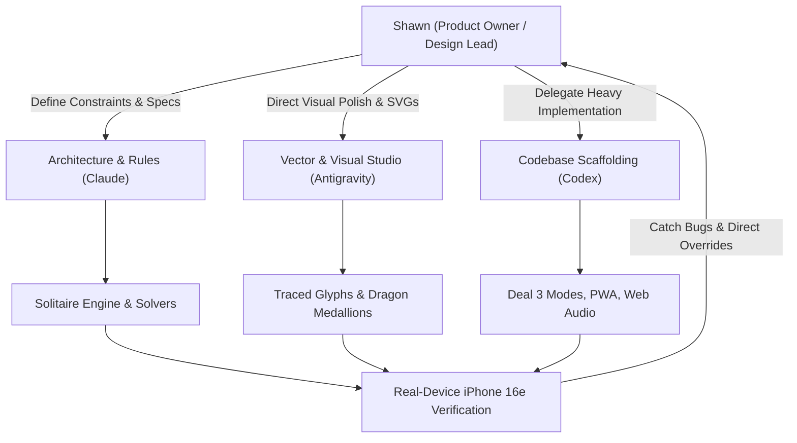

# Solitaire for Low Vision: Product & Design Case Study

**Live Web App:** [sghanna.github.io/agy-solitaire/](https://sghanna.github.io/agy-solitaire/)  
**Repository:** [github.com/sghanna/agy-solitaire](https://github.com/sghanna/agy-solitaire)  
**Role:** Product Owner & Design Lead  
**Collaborators:** AI Coding Assistants (Google Antigravity, Anthropic Claude, OpenAI Codex)  
**Target User:** 78-year-old player with monocular vision and vitreal floaters  
**Platform:** Standalone Progressive Web App (PWA) for iPhone 16e (Safari "Add to Home Screen", offline-first)  

---

## 1. Executive Summary

Commercial mobile card games are fundamentally hostile to low-vision seniors. They pack screens with aggressive full-screen video ads, deceptive close buttons, tiny corner indices designed for 20/20 vision, and cluttered toolbars that cause accidental touches.

When my 78-year-old mother—who has vision in only one eye with floaters—struggled with commercial solitaire apps, I led the end-to-end design and delivery of **Agy-Solitaire**: a zero-friction, ad-free, high-legibility Klondike Solitaire web app engineered from the ground up for her specific sensory, motor, and cultural needs.

By serving as Product Owner and directing an ensemble of AI coding agents, I established strict design constraints, caught critical accessibility bugs that automated tools and naive AI defaults overlooked, and refined the product from initial card typography through to cultural theming, spatial UI ergonomics, and error-prevention architecture.

---

## 2. Core User Constraints

| Constraint | Physical Reality | Product & Engineering Impact |
| :--- | :--- | :--- |
| **Monocular Low Vision** | Sight in one eye only, with floaters obscuring fine details. | Requires high-contrast saturated ink, 2px+ borders, jumbo glyphs, and zero Reliance on fine lines or faint ghost marks. |
| **Mobile Portrait Form Factor** | iPhone 16e (390pt width), held upright one-handed. | 7 Klondike tableau columns must span 390px, capping card widths at ~50px. Sizing must be optimized to the sub-millimeter. |
| **Stacked Card Exposure** | In cascading tableau stacks, only the top strip of covered cards is visible. | The top peek strip must carry 100% of the card's semantic identity (rank, suit, color) unambiguously. |
| **Motor Imprecision & Tap Latency** | Slower tap cadence, minor hand tremors, imprecise thumb target acquisition. | 44px+ minimum hitboxes, 800ms double-tap window, two-tap manual or single-tap auto-move, and strict isolation of destructive controls. |
| **Cultural Resonance** | Hong Kong / Cantonese heritage. | Playing card symbology must be culturally authentic, avoiding inappropriate traditional motifs while celebrating auspicious heritage. |

---

## 3. Key Design Leadership Decisions (Overriding Naive AI Defaults)

AI coding models default to "textbook" design patterns that frequently fail real-world accessibility edge cases. Throughout this project, my role was to challenge defaults, inspect real renders on actual hardware, and enforce rigorous user-centered principles:

### A. Physical Affordance & Error Prevention (The "New Game" Isolation Rule)
- **The AI Default**: AI assistants consistently placed `[＋ New]` immediately adjacent to `[↶ Undo]` in a 2+2 symmetrical cluster or connected segmented console.
- **The Human Insight**: Solitaire players tap `Undo` repeatedly in rapid succession when exploring lines of play. A player with low vision or hand tremors will inevitably miss-tap an adjacent `New Game` button. Even with a confirmation dialog ("Are you sure?"), triggering an accidental modal interrupts flow, causes anxiety, and risks losing a winning game.
- **The Design Override**: I mandated total physical separation:
  - `[＋ New]` locked to the far left.
  - `[↶ Undo]` locked to the far right.
  - Non-destructive utility buttons (`[? Help]` and `[☰ Menu]`) centered via CSS Grid (`1fr auto 1fr`).
  - Result: A **~38px physical buffer zone** surrounding the center. It is physically impossible to hit `New` when spamming `Undo`. Every button is an independent, stand-alone oval pill (`border-radius: 9999px;` 40px height) with high-contrast brass borders and explicit text labels.

### B. Character Anatomy Under Card Overlap (The "Q-Tail" Rule)
- **The AI Default**: Squeezed vertical tableau spacing down to 28px to save screen real estate.
- **The Human Insight**: In Didone-style serif typography, the Queen's distinguishing feature is its downward diagonal tail. At a 28px vertical cascade, the overlapping card beneath covered the tail, causing the Queen (`Q`) to read identically to an `O` for someone with floaters.
- **The Design Override**: Adjusted the vertical cascade step to a minimum of **32px**, guaranteeing that the Queen's tail remains fully exposed and instantly recognizable across all 7 tableau columns.

### C. Cultural Authenticity vs. Presumed Symbology (The Imperial Dragon Pivot)
- **The AI Default**: Reused the Double Happiness (`囍`) Chinese character as a lucky card back.
- **The Human Insight**: When testing with native Cantonese speakers, my Chinese wife flagged that Double Happiness is exclusively a wedding/marriage motif in Hong Kong tradition and is incongruous on playing cards.
- **The Design Override**: I halted production and opened a design exploration of 6 traditional Hong Kong card motifs (Dragon, Phoenix, Bat/Prosperity, Shou/Longevity, Coin/Wealth, Endless Knot). I selected the **Imperial Golden Dragon (金龍)**—the ultimate symbol of luck and strength. I then directed scaling the medallion to an **85% card-back seal (Option D2)** with 36 sunburst notches and a central flaming ruby pearl, and unified this motif across the card backs, victory screens, confirmation dialogs, and floating sky lanterns.

### D. Cognitive De-cluttering & Telemetry Separation (Top vs. Bottom HUD)
- **The AI Default**: Clustered Sound, Moves, Score, Timer, and Game Controls into one dense top navigation bar.
- **The Human Insight**: Information overload. A low-vision player needs to focus on the cards, not be distracted by ticking clock digits or moving score counters. Furthermore, visible timers induce unnecessary pressure.
- **The Design Override**:
  - Removed Sound from the top bar entirely and placed it inside the Menu dialog where audio configuration belongs.
  - Moved Score and Moves down to a floating brass status capsule docked at the bottom of the screen (`pointer-events: none` so cards underneath remain touch-responsive).
  - Hid the Timer by default, making it an optional toggle in the Menu for players who specifically want timed play.

### E. Bespoke Vector Craftsmanship vs. System Emojis
- **The AI Default**: Used standard Unicode emojis (`🎯`, `🃏`, `📦`, `💡`, `🔊`) in instructions and menus.
- **The Human Insight**: System emojis render with cartoonish inconsistency across iOS, Android, and desktop, breaking the game's vintage Hong Kong aesthetic.
- **The Design Override**: Designed bespoke inline vector SVGs matching the game's exact palette (imperial gold filigree, ruby jewels, high-contrast Didone linework) for the How to Play guide:
  - *Goal*: Crowned Foundation Ace with gold rim and jewel.
  - *Moving Cards*: Cascading alternating Red 8 & Gold 7 with cascade arc.
  - *Stock & Waste*: Dragon stock deck dealing into waste fan with recycle loop.
  - *Tips for Mom*: Glowing auspicious sky lantern with tassels and wisdom sparks.

### F. Psychological Safety & Guaranteed Initial Success
- **The Problem**: Classic Klondike Solitaire deals have roughly a 18–20% rate of mathematically unwinnable configurations. Presenting an unwinnable hand on game one is demoralizing and risks product abandonment.
- **The Design Override**: Integrated an algorithmic solver check to guarantee that **Deal #1 is 100% winnable**, building immediate confidence. Added a toggle in Settings allowing players to switch between "Guaranteed Winnable" and "Random" deals.

### G. Attention-Grabbing Motion & Hardware-Accelerated Auto-Win Banner (Low-Vision Peripheral Field Capture)
- **The Problem**: For a monocular player with vitreal floaters, static notifications anchored at the extreme perimeter of the screen (e.g. an "Auto-Finish" button popping up at the bottom) go completely unnoticed during active play.
- **The Human Insight**: When testing with Mom, I noticed she didn't see the auto-win button because her focal vision was locked onto the tableau. Low-vision players detect broad motion across their field of view far more reliably than static color changes at the edge.
- **The Design Override**:
  - Replaced generic celebratory emojis (`🎉`) with an authentic Hong Kong salon starburst emblem (crimson ruby jewel center, imperial starburst filigree, and four gold accent orbs).
  - Designed an unhurried, slow **3.4-second vertical transit** where the banner physically descends from the very top of the screen all the way down across the tableau before softly settling at the bottom with a 10px gravitational bounce and radiant pulse.
  - Made the **entire banner a unified touch hitbox**, eliminating precision targeting stress.
- **The Technical Achievement**: Early CSS keyframe prototypes animating `box-shadow` (40px blur) and `border-color` suffered severe CPU main-thread thrashing (choppy ~20fps) and subpixel vector snapping. In a collaborative CLI session with Claude and Codex, we re-architected the motion using the **Web Animations API (`translate3d`)** paired with a **zero-repaint GPU compositor pseudo-element (`::after` opacity-only pulse)**, achieving a flawless 60fps/120fps glide across the tableau with instant on-demand replay.

### H. Narrow-Screen Ergonomics & Touch Clearance (The iPhone 13 mini Borderless Telemetry Rule)
- **The Problem**: On narrower mobile displays (such as the 375px viewport of an iPhone 13 mini), enclosing bottom HUD stats (Score, Moves, Timer) in a solid bordered pill container crowded out the bottom-left circular `[?]` Help button. The edge of the pill nearly touched the circle, creating severe visual clutter and accidental miss-taps.
- **The Design Override**: Stripped the pill boundary, solid background, and heavy box-shadow entirely. Score and Moves now float cleanly and borderless directly on the imperial pine felt, backed by high-contrast layered drop shadows (`0 1px 3px / 0 2px 8px`). This reclaimed **35px+ of horizontal space**, expanding the physical clearance buffer between the Help button and the Score label to over **65px**.

### I. Zero-Pollution Trilingual Internationalization (Strict English Default & Storage Isolation)
- **The Problem**: To support my mother and our wider family, the game supports English, Spanish (*Español*), and Vietnamese (*Tiếng Việt*). However, multi-language preview iframes on our review page were inadvertently calling `setLanguage('vi')` and cross-contaminating the shared domain `localStorage`, accidentally locking players into Vietnamese on fresh game loads.
- **The Design Override**:
  - Established a **strict English default policy**: The game always initializes in English unless the player deliberately chooses Spanish or Vietnamese in the in-game Settings menu.
  - Eliminated unreliable device language sniffing in favor of explicit user agency.
  - Isolated player preferences under a dedicated key (`agy_solitaire_user_lang`) and switched review iframes to stateless URL parameters (`?lang=`), ensuring demo environments never corrupt the user's saved experience.

---

## 4. Multi-AI Orchestration & Delivery Workflow

To build this product quickly without sacrificing quality, I operated as the strategic conductor across three AI agent environments:

1. **Architecture & Specification**: Wrote explicit engineering briefs defining column dimensions, touch target math, and state machines.
2. **Head-to-Head Multi-AI Bake-Offs**: When choosing the core card face or diagnosing complex animation frame hitches, I ran multi-AI consultations across Claude, Codex, and Antigravity, synthesizing architectural solutions directly from the CLI.
3. **The "Never Trust CSS Arithmetic" Rule**: Automated layout math often lies on high-DPI mobile viewports. I instituted a hard policy: every sizing change must be rendered to PNG via WebKit/Chrome headless at the exact 390pt (and 375pt) viewport width and visually verified before shipping.

---

## 5. Technical Highlights & Performance

- **Zero-Dependency Architecture**: Built in vanilla HTML5, CSS3, and modern ES6 JavaScript. Zero external frameworks, zero trackers, zero ad SDKs.
- **Hardware-Accelerated Web Animations API (`WAAPI`)**: 3.4-second gravitational drop animation executed via native `element.animate()` using `translate3d` and GPU compositor layers, eliminating CSS layout recalculations and guaranteeing 60fps/120fps smoothness.
- **Zero-Repaint GPU Compositor Glow Layer**: Transferred pulsing gold aura effects to an isolated `::after` pseudo-element with `will-change: opacity`, offloading 100% of glow animation to the GPU compositor.
- **Offline PWA**: Service Worker cache-first architecture (`CACHE_NAME = 'agy-solitaire-v22'`) allows immediate home-screen installation and full offline play with zero network latency.
- **Procedural Tactile Web Audio**: Custom Web Audio API synthesizer generating organic card rustles, snap clicks, and celebration tones with automated audio context unlocking on first touch.
- **Automated Regression Suite**: 3 dedicated headless test suites (`test_solitaire.js`, `test_settings_features.js`, `test_ace_and_single_deal.js`) covering card moves, undo history, winnable deal generation, and HUD persistence.

---

## 6. Takeaways for Product & Design Leadership

1. **Accessibility is not a checklist; it is an empathy engine.** Designing for an individual user with severe sensory constraints generated solutions that made the product cleaner, faster, and more delightful for everyone.
2. **AI needs human direction, not just prompts.** AI can write thousands of lines of syntax in seconds, but it cannot feel when an Undo button is too close to New, or know that a Chinese wedding character is wrong for a card game. Product judgment, taste, and user advocacy remain uniquely human superpowers.
3. **True ergonomics happen at the physical edge.** When software interacts with the physical world—a thumb holding a phone, an eye reading under floaters—the smallest details (4px of waste fan overlap, 4mm of button separation) dictate whether a product is loved or abandoned.
